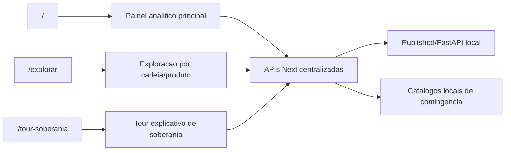

# Arquitetura de rotas

## Experiencia Next

## Contrato de navegacao

- `/`: entrada oficial do produto. Resume sinais executivos, KPIs agregados,
  alerta principal e caminhos para aprofundamento.
- `/explorar`: bancada de exploracao por cadeia, produto, indicador,
  territorio e codigos tecnicos.
- `/tour-soberania`: jornada guiada para explicar NIB, HHI, proporcionalidade
  RenovaCalc e rede AIPNET.
- `dashboard/` ou `http://localhost:8765`: base tecnica temporaria para
  auditoria, homologacao e rastreabilidade enquanto a experiencia Next absorve
  todas as capacidades.

## Camada de APIs

As telas Next devem consumir somente endpoints locais sob `app/api`. A montagem
das URLs fica centralizada em `lib/apiRoutes.ts`.

- `/api/conceptual-products`: alimenta o painel raiz e a exploracao conceitual.
- `/api/chain/[chain_name]`: proxy Next para a API Published por cadeia.

A API Published/FastAPI continua sendo fonte tecnica de dados, mas nao deve ser
chamada diretamente por componentes de interface.
